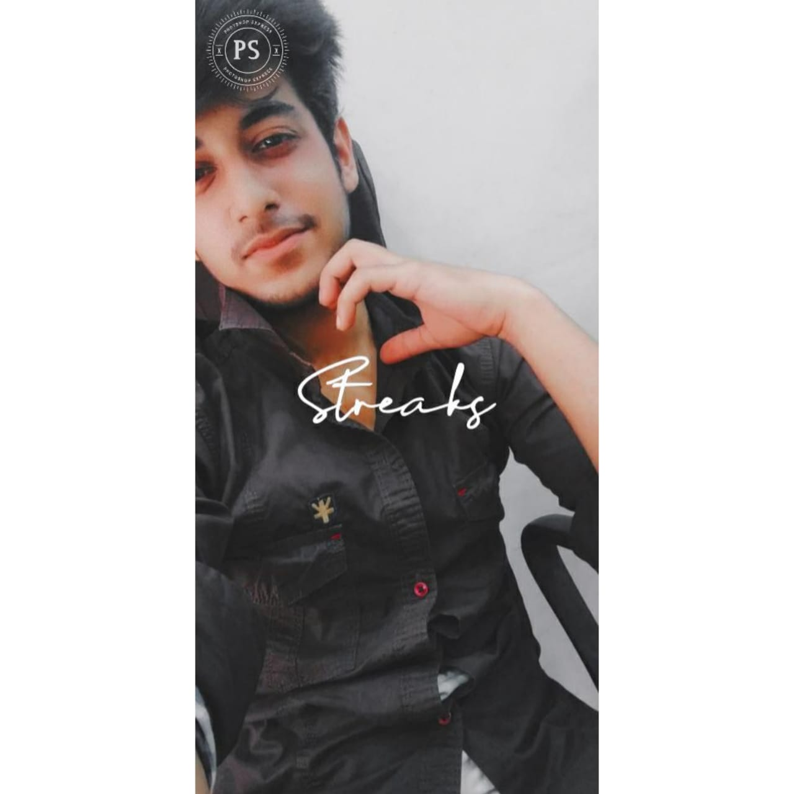
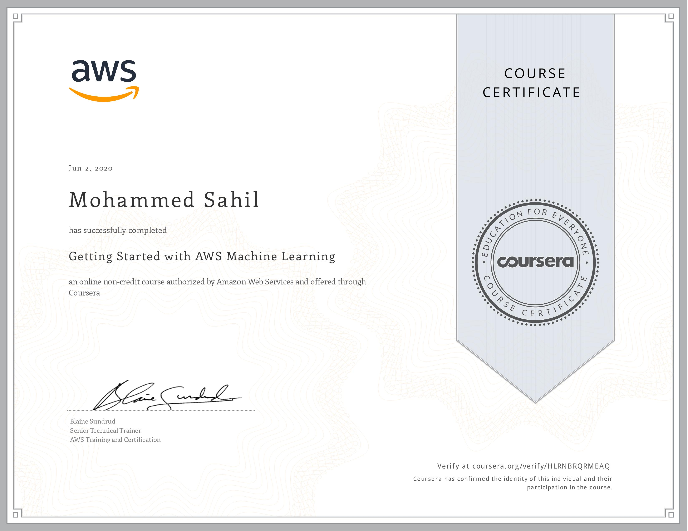
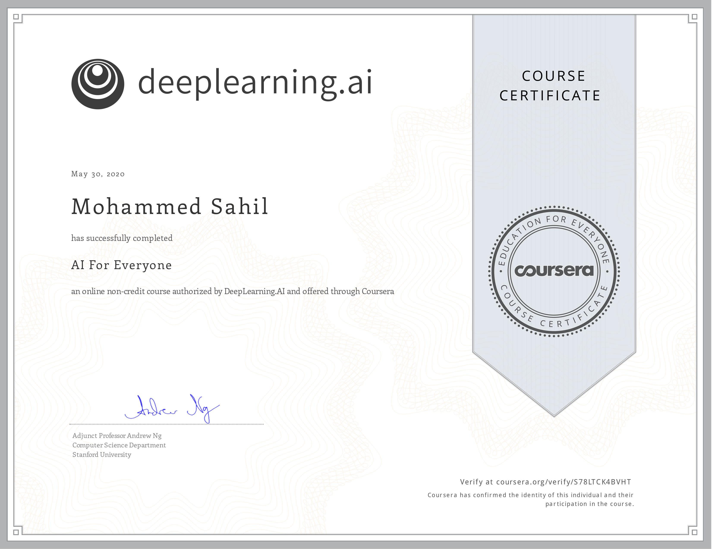
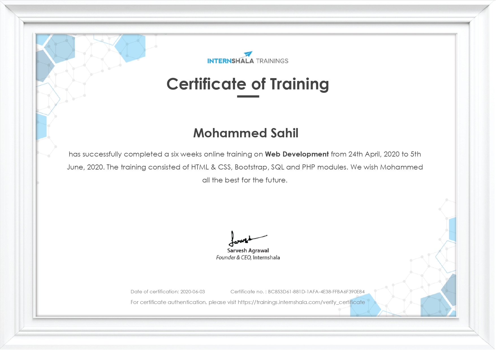
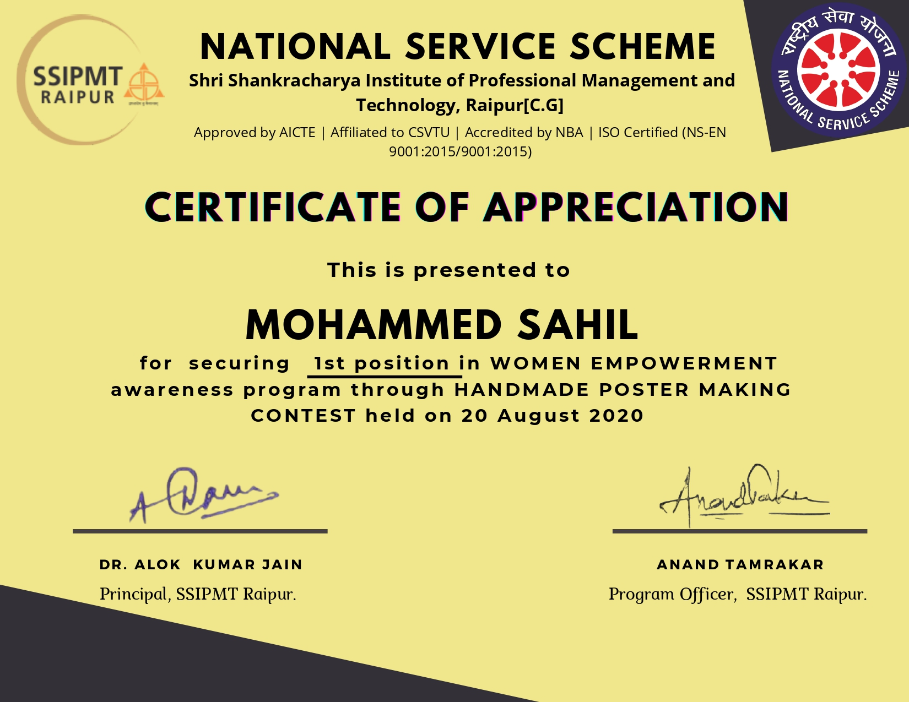
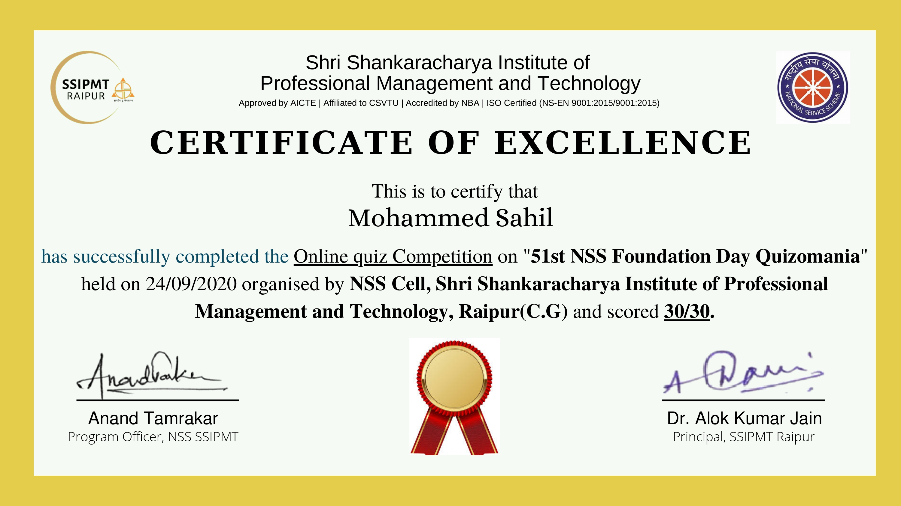
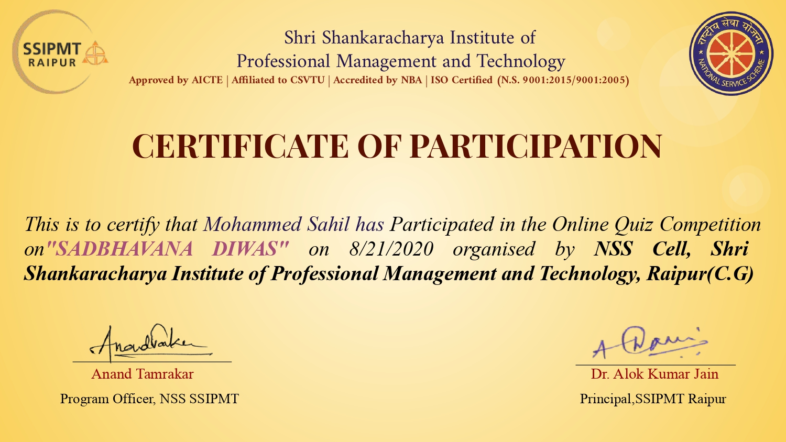

# sahil

<html>
	<head>
		<title>My First HTML Page</title>

		<meta name="viewport" content="width=device-width, initial-scale=1.0">

		
	</head>
<body>
		

			

				

				

					<h4>Sahil Saify</h4>
					
Web Developer 
					CSE Student

				

			

		

		

			

				<a href="">Projects</a><a href="">About</a><a href="">Contact</a>
			

		

		

			

				<h2>Projects/Certifications</h2>
			

		

			

				

					
					
AMAZON WEB SERVICES

					
6 Weeks Complete project 

				

				

					
					
ARTIFICIAL INTELLIGENCE

					
Project Description- Full course Machine learning and AI.

				

				

					
					
WEB DEVELOPMENT

					
Project Description- Full stack webpage dovelopment.

				

			

		

			

				

					
					
FIRST PRIZE IN PAINTING

					
Project Description - Painting competition by NSS.

				

				

					
					
QUIZ COMPETITION

					
Project Description- Full marks in NSS quiz

				

				

					
					
Participation In NSS Quiz

					
Nss quiz participation on foundation day

				

			

		

		

			

				<h2>About Me</h2>
			

		

			

				

					<h4 class="aligncenter">Personal Details</h4>
					<ul>
						<li>Sahil Saify</li>
						<li>DOB: 30-10-01</li>
						<li>PHONE:_________</li>
						<li>Status: Umarried</li>
						<li>Under-graduate</li>
					</ul>
				

				

					<h4 class="aligncenter">Education/Skillset</h4>
					<ul>
						<li>B.Ttech</li>
						<li>HTML</li>
						<li>CSS</li>
						<li>PHP</li>
						<li>Developer</li>
					</ul>
				

			

		

		

			
&copy; Copyright 2020.

		

	</body>
</html>

